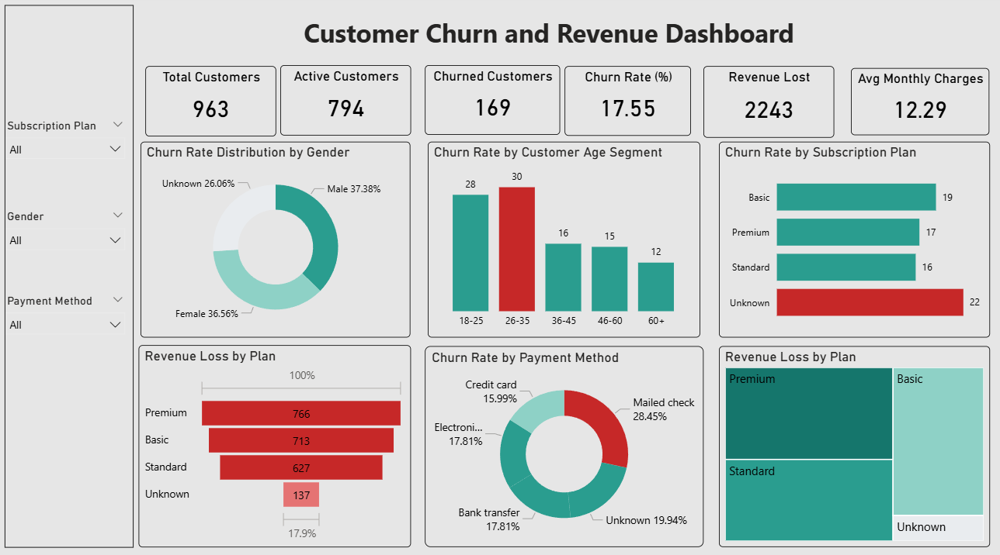

# Customer-Churn-Dashboard
##1. Project Title / Headline

Customer Churn and Revenue Dashboard – Power BI

Developed an interactive Power BI dashboard to analyze customer churn, subscription behavior, and revenue impact to understand customer retention trends.

##2. Short Description / Purpose

This Power BI dashboard provides insights into customer churn across different demographics, subscription plans, and payment methods. It helps businesses identify patterns and factors that lead to customer churn and revenue loss.

##3. Data Source

Dataset: Customer Churn Dataset

###The dataset includes information about:

-Customer demographics

-Subscription plans

-Payment methods

-Churn status

-Revenue and monthly charges

##4. Features / Highlights

###Business Problem

Businesses require customer analytics to identify churn patterns, revenue loss, and high-risk customer segments affecting retention.

###Goal of the Dashboard

To provide interactive analytics for monitoring customer churn trends and revenue impact.

###Key Visuals

-KPI Cards

-Churn Rate by Gender

-Churn Rate by Age Group

-Churn Rate by Subscription Plan

-Revenue Loss by Plan

-Churn Rate by Payment Method

-Revenue Distribution

##5. Insights

-The 26–35 age group has the highest churn rate.

-Basic and Unknown subscription plans show higher churn.

-Mailed check payment method has the highest churn rate.

-Premium plan contributes the highest revenue loss.

##6.Screenshot

